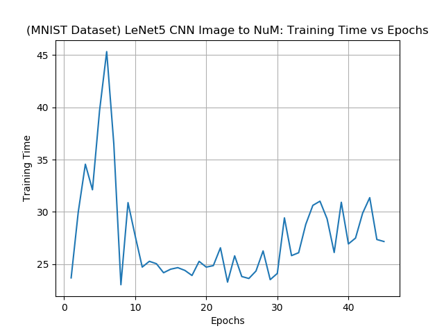
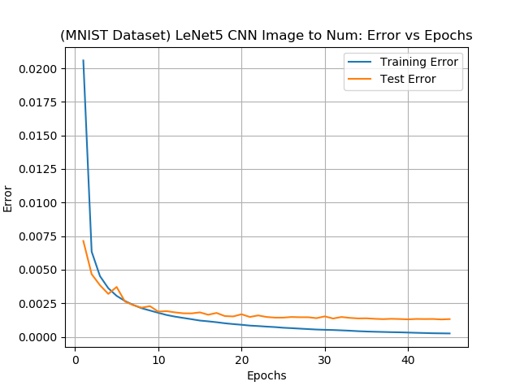
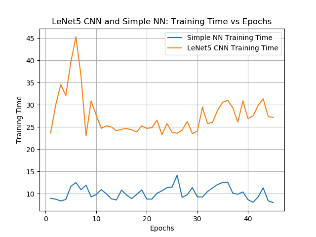
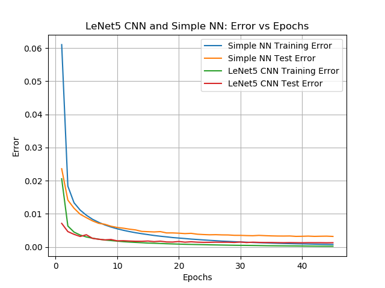
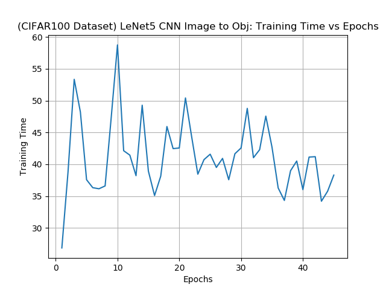
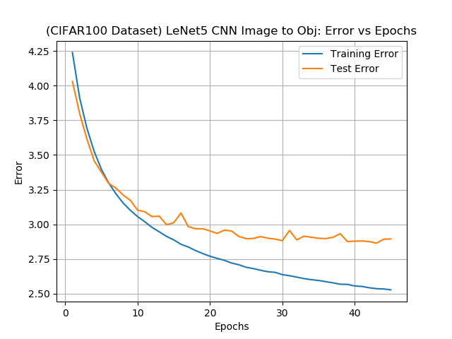
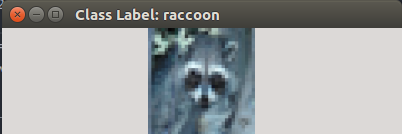
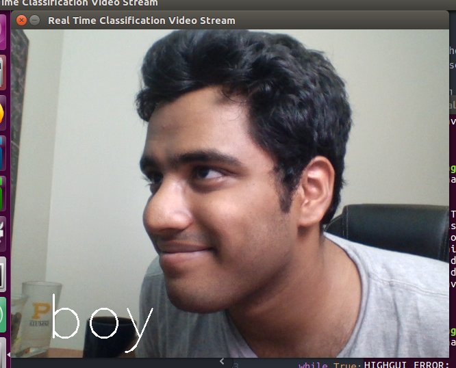
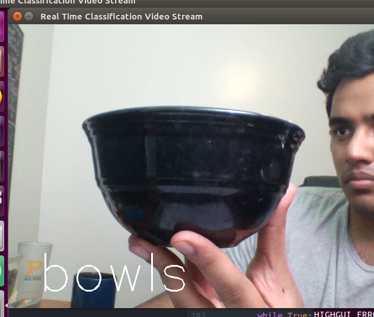

## Real Time Classification Video Stream Using CIFAR100 LeNet5 Convolutional Neural Network Model 
#### Aakash Pydi
---

In img2num.py, a LeNet5 convolution neural network is used to carry out classification for the MNIST (handwritten digits) dataset. In img2obj.py, a LeNet5 convolution neural network is used to carry out classification for the CIFAR100 dataset. Note that nn_img2num.py is also included to carry out comparison of the LeNet5 CNN model and the simple NN model from the last homework. (This was done by storing the plot details from img2num.py and then accessing that information from nn_img2num, and then subsequently plotting the required charts). The file lenet5_data.tar has the required plot information from running img2num.py.

The file saved_cnn_model_save.tar stores the evaluated CIFAR100 LeNet5 CNN model. This allows one to quickly load the model (circumventing the lengthy training time). If one wants to train the model again, simply delete this save file.

The associated results are given below.

---

### Image to Number (MNIST Dataset)

#### Comparison Between LeNet5 CNN and Simple NN for MNIST Digit Classification

---

### Image to Object (CIFAR100 Dataset)

#### One Object and its Caption

#### Continuous Captioning of Images from a Webcam

